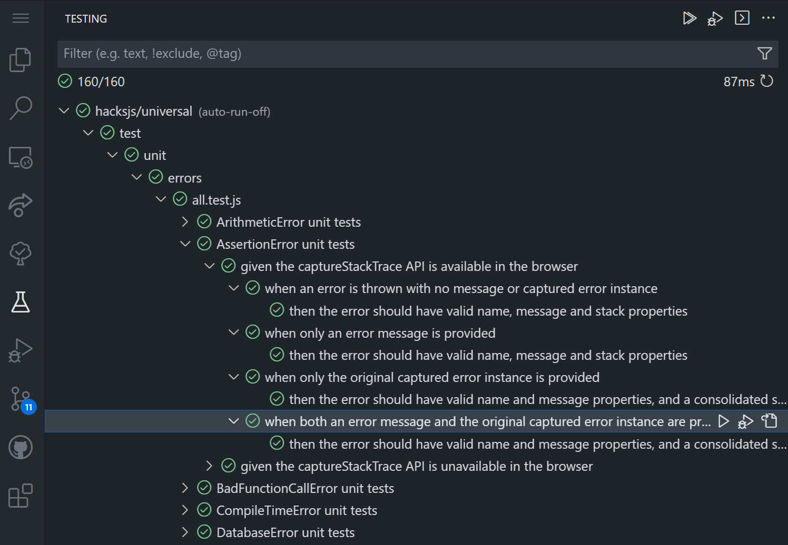

= Jest

https://jestjs.io/[Jest] is a JavaScript testing framework, developed and actively maintained by Meta/Facebook. Built on https://jasmine.github.io/[Jasmine], an alternative testing framework to the venerable https://mochajs.org/[Mocha], Jest focuses on simplicity and convention-over-configuration to make things "just work" out-of-the-box. Via extensions, it also benefits from excellent integration with link:./vscode.adoc[VS Code].

////

TODO: Because https://jestjs.io/docs/ecmascript-modules[built-in support for ECMAScript Modules is still experimental in Jest], so we continue to https://jestjs.io/docs/getting-started#using-babel[integrate Jest with Babel].

TODO: `@types/jest` is not needed any more because we explicitly import Jest globals into our test scripts. We use an abstraction for this, which should make it easier to switch the test framework in the future.

////

== Run-scripts

The automated tests — executed by Jest — can be controlled via run-scripts such as `npm run test`. See the documentation on link:../workflow/testing.adoc[testing] for details.

== Jest configuration

The file `./jest.config.js` provides default configuration for the `jest` command. See the documentation on https://jestjs.io/docs/configuration[configuring Jest] for details of the available options.

== VS Code integration

We RECOMMEND using the https://github.com/jest-community/vscode-jest[vscode-jest] extension to integrate Jest into VS Code's UI. This extension makes it easy to run individual test suites from VS Code's integrated Test Explorer panel.

The extension is configured with the following settings, via `./.vscode/settings.json`.

The `jest.jestCommandLine` setting is used to tell the extension to  use the command `npm run test` in place of `jest`. This means the tests will be run using the locally-installed instance of `jest`. Therefore, Jest does not need to be installed into Node's global space on each development machine.

The `npm run test` command is appended with `--`. This allows the VS Code extension to add arguments, which will get passed to the `jest` program.

----
{
  "jest.jestCommandLine": "npm run test -- "
}
----

The `jest.autoRun` option is used to control how and when the VS Code should automatically run our test suites. We tend to use the following configuration, which disables the Jest extension from auto-running tests in any situation. We prefer to trigger test runs manually, via the Test Explorer controls.

----
{
  "jest.autoRun": {
    "watch": false,
    "onStartup": []
  }
}
----

For more information about this configuration, see the section on https://github.com/jest-community/vscode-jest#how-to-trigger-the-test-run[how to trigger the test run] in the extension's documentation.

////

If you're opening this project in the context of a larger VS Code workspace, it is recommended you explicitly disable the Jest extension for other folders within your workspace that do not use Jest. For example, imagine a workspace consisting of three folders, including one for the Hacks.js project. The `settings.json` file for the workspace might look something like this:

----
{
  "folders": [
    {
      "path": "hacksjs"
    },
    {
      "path": "dot-files"
    },
    {
      "name": "🌐 website",
      "path": "website"
    }
  ]
}
----

To disable the Jest extension in the other two workspace folders, you would need to add the following configuration to a settings property called `jest.disabledWorkspaceFolders`:

----
{
  "folders": [
    {
      "path": "hacksjs"
    },
    {
      "path": "dot-files"
    },
    {
      "name": "🌐 website",
      "path": "website"
    }
  ],
  "settings": {
    "jest.disabledWorkspaceFolders": [
      "dot-files",
      "🌐 website"
    ]
  }
}
----

////

== Debug configuration

The following configuration in `./.vscode/launch.json` is automatically used by the `vscode-jest` extension whenever the "Debug Test" option is chosen via the extension. This configuration allows the extension to substitute variables in the command line arguments. For more information about this configuration, see the documentation on https://code.visualstudio.com/docs/nodejs/nodejs-debugging#_launch-configurations-for-common-scenarios[the debug launch configuration for vscode-jest].

----
{
  "version": "0.2.0",
  "configurations": [
    {
      "type": "node",
      "name": "vscode-jest-tests.v2",
      "request": "launch",
      "args": [
        "--runInBand",
        "--watchAll=false",
        "--testNamePattern",
        "${jest.testNamePattern}",
        "--runTestsByPath",
        "${jest.testFile}"
      ],
      "cwd": "${workspaceFolder}",
      "console": "integratedTerminal",
      "internalConsoleOptions": "neverOpen",
      "disableOptimisticBPs": true,
      "program": "${workspaceFolder}/node_modules/.bin/jest",
      "windows": {
        "program": "${workspaceFolder}/node_modules/jest/bin/jest"
      }
    }
  ]
}
----
